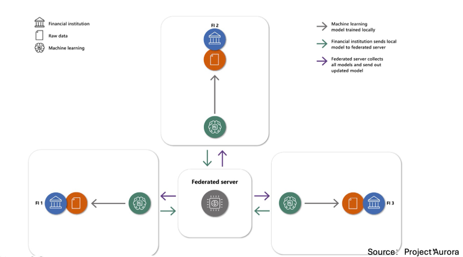

# Decentralized_aml_demonstrator

Decentralized AML Demonstrator is a federated learning pipeline for bank anti-money laundering on AMLSim-generated multi-bank data. Each bank trains locally on labeled account-level SAR data and shares model updates to learn a global detector of suspicious accounts without sharing raw data. The model layer is adapter-based and currently defaults to logistic regression (SGD), with room to extend to other ML/DL/GNN models.



The directory structure of the AMLSim workspace and this repository is expected to be as follows:

```text
~/projects/aml/
├── amlsim/                          ← AMLSIM workspace
│   └── AMLSIM/                      ← AMLSim repository
│       ├── .venv/                  ← virtual environment for AMLSIM
│       ├── jars/
│       ├── scripts/
│       └── ...
│
└── decentralized_aml_demonstrator/ ← this project
    ├── data/                       ← processed datasets
    └── scripts/                    ← data processing & training
        ├── 02_process_data.py
        ├── 03_train_local_baseline.py
        ├── 04_federated_round.py
        ├── 05_evaluate.py
        └── ...
```
> **Note:** Python 3.7 is required for compatibility with AMLSim. So, we separately create a virtual environment for AMLSim and another for this project.

## Quickstart (Modeling Only)

Assumes data already exists (if not, go to full step for the first time) under:
- `data/raw/<bank>`

By default, bank names come from `config.yaml` (currently: `bank_s`, `bank_m`, `bank_l`).

Process data, run federated training, local baseline training, and evaluation:
```bash

cd /path/to/decentralized_aml_demonstrator/ # cd /home/admin_ml/Jackson/projects/aml/decentralized_aml_demonstrator/

deactivate # optional, deactivate AMLSim venv if active

python -m venv .venv        # if not exists
source .venv/bin/activate
pip install -r requirements.txt


python scripts/02_process_data.py
python scripts/03_fl_train.py
python scripts/04_train_local_baseline.py
python scripts/05_test_evaluate.py
```

If you only want to run first round of federated training, you can run:
```bash
python scripts/03g_fl_round1_val_eval.py
```

## Full Setup and Data Generation

### 1.0 Setup
- Clone the AMLSim repository to your local machine, e.g., under `~/projects/aml/amlsim/`:
    ```bash
    git clone https://github.com/IBM/AMLSim.git
    ```
- Clone this `decentralized_aml_demonstrator` repository to your local machine, e.g., under `~/projects/aml/`:
    ```bash
    git clone https://github.com/Jackson00Han/decentralized_aml_demonstrator.git
    ```
- Create Virtual Environment under this repository and install dependencies:
    ```bash
    python -m venv .venv        # if not exists
    source .venv/bin/activate
    pip install -r requirements.txt
    ```

### 2.0 One-time AMLSim setup

0. Set AMLSim path as an environment variable

    ```bash
    export AMLSIM_DIR=$HOME/projects/AMLSim
    ```
   Example:
    ```bash
    export AMLSIM_DIR=/home/admin_ml/Jackson/projects/aml/amlsim/AMLSim 
    ```
1. Copy the `requirements.txt` file and the `three_banks_10K` parameter folder into the AMLSim directory:
    
    The files associated with AMLSim are provided in the folder `decentralized_aml_demonstrator/move_to_amlsim` for convenience.
    ```bash
    cp /path/to/decentralized_aml_demonstrator/requirements.txt "$AMLSIM_DIR"/requirements.txt
    cp -r /path/to/decentralized_aml_demonstrator/three_banks_10K "$AMLSIM_DIR"/paramFiles/
    ```

2. System dependencies (Ubuntu):
    ```bash
    sudo apt-get update
    sudo apt-get install -y maven graphviz graphviz-dev pkg-config
    ```

3. Verify Java:
    ```bash
    java -version
    javac -version
    ```

4. Install Python 3.7 via pyenv(is missing)
    ```bash
    pyenv install 3.7.17
    ```

5. Create AMLSim venv:
    ```bash
    cd "$AMLSIM_DIR"
    pyenv local 3.7.17

    python -m venv .venv
    source .venv/bin/activate
    pip install -U pip
    pip install -r requirements.txt
    pip install pyyaml
    deactivate
    ```

6. Java build: install external MASON jar(required)
    AMLSim depends on mason:mason:20 which is not in Maven Central, so it must be installed locally.
    ```bash
    cd "$AMLSIM_DIR"

    # download mason jar
    wget -O jars/mason.20.jar https://cs.gmu.edu/~eclab/projects/mason/mason.20.jar

    # install into local maven repo
    mvn install:install-file \
    -Dfile=jars/mason.20.jar \
    -DgroupId=mason \
    -DartifactId=mason \
    -Dversion=20 \
    -Dpackaging=jar
    ```

7. Build AMLSim jar
    Important: use bash (not sh) for AMLSim scripts
    ```bash
    cd "$AMLSIM_DIR"
    bash scripts/build_AMLSim.sh
    ```
Now AMLSim setup is complete.

### 2.1 Generate data with AMLSim
AMLSim is an external dependency and should be cloned outside this repository.


0. Set the AMLSim path if it is not already set:

    ```bash
    export AMLSIM_DIR=$HOME/projects/AMLSim
    ```
   Example:
    ```bash
    export AMLSIM_DIR=/home/admin_ml/Jackson/projects/aml/amlsim/AMLSim 
    ```

1. Use AMLSim's Python virtual environment to run the data generation script (`01_generate_data.py`) provided in this repository.
    ```bash
    source "$AMLSIM_DIR/.venv/bin/activate"

    cd /path/to/decentralized_aml_demonstrator/ # cd /home/admin_ml/Jackson/projects/aml/decentralized_aml_demonstrator/

    python scripts/01_generate_data.py
    ```
    After completion, the generated files will be copied into the `decentralized_aml_demonstrator/data/raw` folder.

2. Remember to deactivate the AMLSim virtual environment after use:
    ```bash
    deactivate
    ```
Now, you will have data under decentralized_aml_demonstrator/data/raw/

